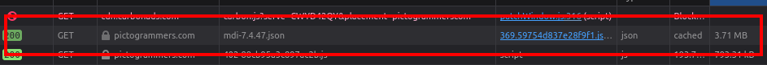

**mdi-svg-as-json** Downloads and saves a json file containing all currently supported *Material Design Icons* and their svg representation from https://pictogrammers.com/library/mdi.

Current MDI version in this dump: **7.1.96**

## Usage

* The list of all icons with their svg paths is delivered from the pictogrammers server in a JavaScript file. The URL of the file is hard-coded in the script. As long as this URL does not change on the server, you only need to run the script to get all current icons.
* If the URL changes - which seems likely - it is easy enough to get the new URL: it is (at least for now) the largest file being loaded when visiting the MDI page.
